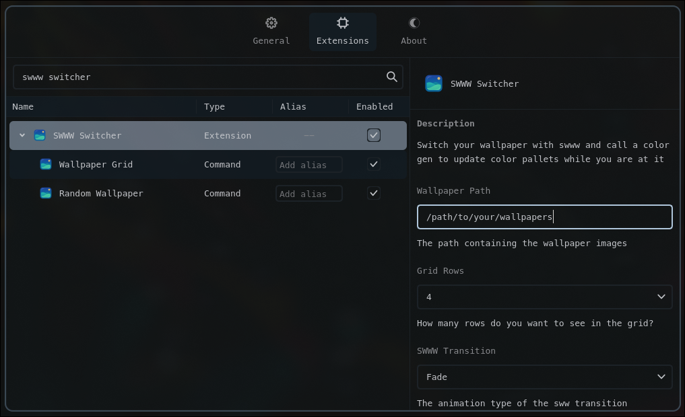

# SWWW Switcher (Vicinae Extension)

Choose wallpapers from a gird and apply with swww. Select from a color generator too!


## Features

- Choose a path in extension settings
- Grid layout of images in the path
- One-tap apply via `swww`
- Add a swww transition
- Add a color generator to run on the image

## Requirements

- Linux with Hyprland
- swww `swww`
- Color generator like `matugen`
- Images in one of: jpg, jpeg, png, webp

## Commands

- `wallpapergrid` — Open the wallpaper browser and set a wallpaper

## Quick start (development)

```bash
npm install
npm run dev
```

This starts the extension in Vicinae dev mode. Follow Vicinae’s docs for how to connect a dev extension if needed.

## Build (production)

```bash
npm run build
```

This produces a production bundle that can be distributed/installed per Vicinae guidelines.

## Usage

1. Open extension settings and set the path to your images



2. Launch `wallpaper grid`

3. Search or scroll, preview the image, then choose “Set” to apply it

Notes:

- Color generator tools like `matugen` will need to be set up independently of this Extension.

## Future Features?

- Random transition
- More then SWWW?
- Maybe offer matugen config for Vicinae?

## License

MIT
