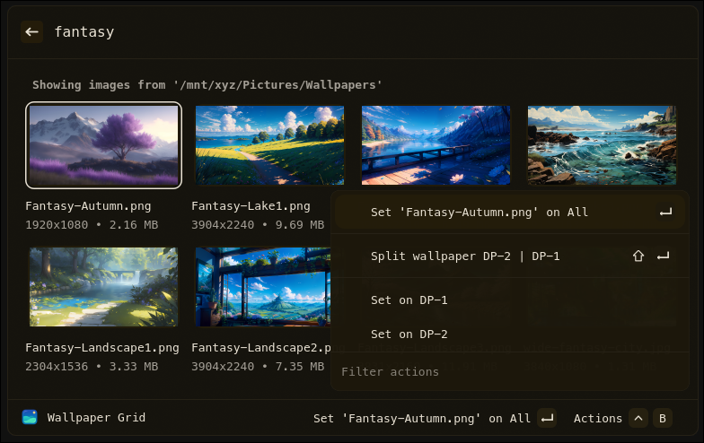

# SWWW Switcher (Vicinae Extension)

Pick a wallpaper from a grid and apply with swww with a transition of your choosing. You can even generate a color palette from the wallpaper!

Dont feel like picking a wallpaper? Just run Random Wallpaper!



## Features

- Choose a path in extension settings
- Grid layout of images in the path
- One-tap to set wallpaper via `swww` on all or a single monitor
- Add a sweet swww transition, configure the duration and steps too
- Add a color generator to run on the image
- Set a random wallpaper

## Requirements

- Linux with Hyprland
- [vicinae](https://github.com/vicinaehq/vicinae) v0.12.2 or higher
- [swww](https://github.com/LGFae/swww)
- Images in one of: jpg, jpeg, png, webp, gif
- Optional: Color generator like [matugen](https://github.com/InioX/matugen)

## Commands

- `Wallpaper grid` — Open the wallpaper browser and set a wallpaper
- `Random Wallpaper` — Randomly apply a wallpaper

## Extension Preferences


 - Wallpaper Path
 - SWWW Transition Type
    - Default = `random`
 - SWWW Duration (In seconds)
    - Default = `3`
 - SWWW Transition Step
   - Default = `90`
 - Color Generator
   - Default = `none`
 - Grid Rows
   - Default = `4`
 - Toggle Vicinae on Selection
   - Default = `true`
 - Show Image Details
   - Default = `true`
 - leftmonitor
   - Default = `unset`
 - rightmonitor
   - Default = `unset`

## Quick start (development)

```bash
npm install
npm run dev
```

This starts the extension in Vicinae dev mode. Follow Vicinae’s docs for how to connect a dev extension if needed.

## Build (production)

```bash
npm run build
```

This produces a production bundle that can be distributed/installed per Vicinae guidelines.

## First Usage
1. Launch `wallpaper grid`

2. Set the path to your images.

3. Search or scroll for that perfect image, then choose “Set” to apply it to all monitors. Go into the menu to apply it to only one monitor.

4. Change extension settings to suit your needs.

## Split One Wallpaper for Two Monitors

- If you set `Left Monitor Name` and `Right Monitor Name` in the extension preferences, you can split the image in half.
  - The names must be present in the `hyprctl monitors -j` array for the action to appear.


- If you set `Left Monitor Name` and `Right Monitor Name` in the extension preferences, you can split the image in half.
  - The names must be present in the `hyprctl monitors -j` array for the action to appear.

## Color Generator:

- Color generator tools like `matugen` will need to be set up independently of this Extension. I will provide my matugen files to get you started.

1. Save a template file where ever you'd like. Example below.
```
{
  "version": "1.0.0",
  "appearance": "dark",
  "icon": "./matugen.png",
  "name": "Matugen",
  "description": "Changes based on wallpaper.",
  "palette": {
    "background": "{{colors.background.default.hex}}",
    "foreground": "{{colors.on_background.default.hex}}",
    "blue": "{{colors.on_primary_container.default.hex}}",
    "green": "{{colors.on_secondary_container.default.hex}}",
    "magenta": "{{colors.on_tertiary_container.default.hex}}",
    "orange": "{{colors.error_container.default.hex}}",
    "purple": "#C792EA",
    "red": "{{colors.error.default.hex}}",
    "yellow": "#FFCB6B",
    "cyan": "#21C7A8"
  }
}
```
2. Call Template File from the matugen config.toml

```
[templates.vicinae]
input_path = '~/.config/matugen/templates/vicinae.json'
output_path = '/home/username/.config/vicinae/themes/matugen/matugen.json'
post_hook = 'vicinae vicinae://theme/set/matugen'
```
3. Note the post hook. That's how you get Vicinae to apply the new theme.

## Add this extension to your Hyprland config

This is how I have this added to my keybindings:

```
$mainMod = SUPER
bind = $mainMod CTRL, W, exec, vicinae vicinae://extensions/sovereign/swww-switcher/wpgrid
bind = $mainMod SHIFT, W, exec, vicinae vicinae://extensions/sovereign/swww-switcher/wprandom
```

## License

MIT

## Thank you

I took code from [lmm1ng](https://github.com/lmm1ng/hyprpaper_switcher_ext) and [schromp](https://github.com/schromp/vicinae-extensions/tree/main/swww) for this project. They helped me learn how to make an extension for Vicinae. Thank you!
